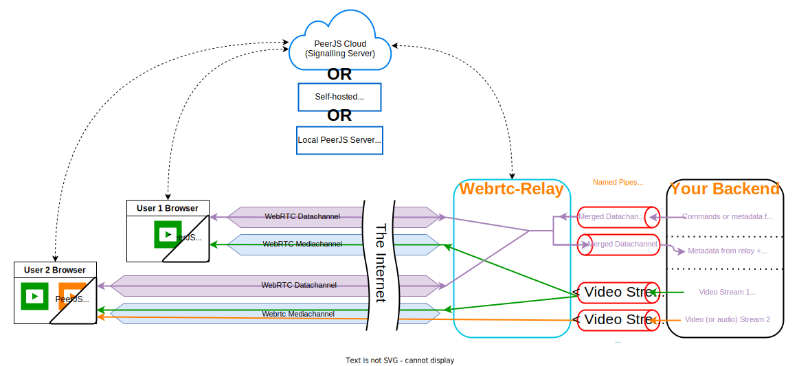

# WebRTC Relay

Relay low latency video and data between remote computers and any web browser over WebRTC. This tool is programing language independent (using named pipes) and should compile on \*any os where golang is supported (\*except windows for now).

## Inspiration

I made this tool as an alternative to UV4L-WebRTC with fewer webrtc-related constraints. My orignal use case was for controlling underwater drones over the internet, but this library could be used for any purpose where low latency video and/or data transport are needed. This project is a lot like [Bot Box](https://github.com/roboportal/bot_box) but with more flexibility, at the cost of less being implemented for you: bring your own frontend / backend etc...

## Details

Behind the scenes, this tool uses the [Pion WebRTC](https://github.com/pion/webrtc) stack and the Peerjs-go library for all the WebRTC-related stuff. This means you can use the PeerJS browser library and any peer.js signaling server (including the inbuilt peerjs-go signaling server) to make the webrtc connection easier. For the back-end interface, you can uses named pipes to send and recieve datachannel messages and video streams from your backend language of choice (so long as it supports reading and writing to named pipes)

## Standalone Install

1. Install [Golang](https://go.dev) for your platform.

   > Note On raspberry pi, apt ships an old version of go, so I recommend installing the latest version from the [Go website](https://go.dev/dl) - [Tutorial](https://www.jeremymorgan.com/tutorials/raspberry-pi/install-go-raspberry-pi)

2. In a terminal run: **`go install github.com/kw-m/webrtc-relay/cmd/webrtc-relay@latest`**

## Use in a Go program

1. Add the program to your go.mod with **`go get github.com/kw-m/webrtc-relay`**

2. See the [examples/golang](/examples/golang) folder

## Use with another programming language

1. To start the relay run the command: **`webrtc-relay -config-file "path/to/your/webrtc-relay-config.json"`**
   > **NOTE:** The python examples start the relay (run this command) as part of the example code.
2. See the [examples/python](examples/python) for a simple python interface as well as example webrtc-relay-config.json files.
3. Basic idea for sending messages to browsers through the webrtc data channel:
   1. The relay will create two named pipe files in the "relayPipeFolder" (specified in your webrtcRelayConfig.json)
   2. One

**Compressed video stream could come from:**

Raspicam or Libcamera-vid on the Raspberry Pi for hardware encoded video stream.

ffmpeg can get you a hardware encoded stream on most devices.

**You don't need your own server to make this work (peerjs cloud is used by default) but hosting your own peerjs server gives you more control**
